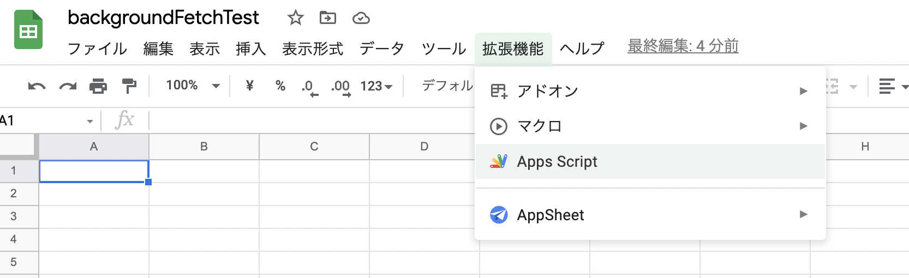
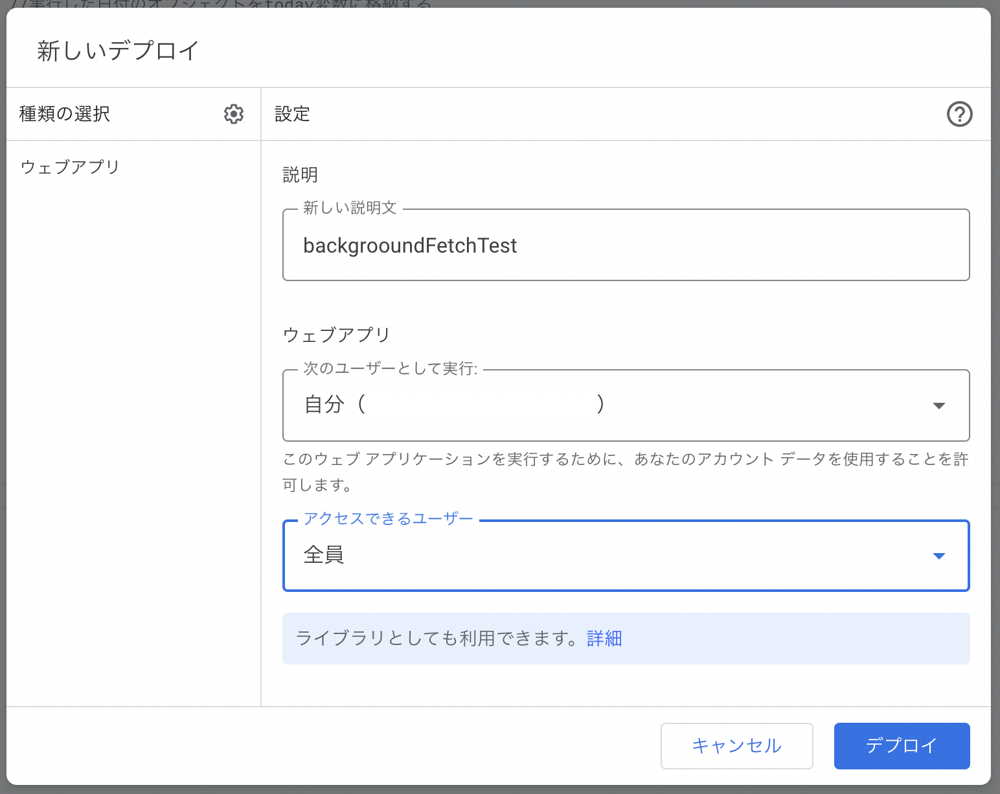
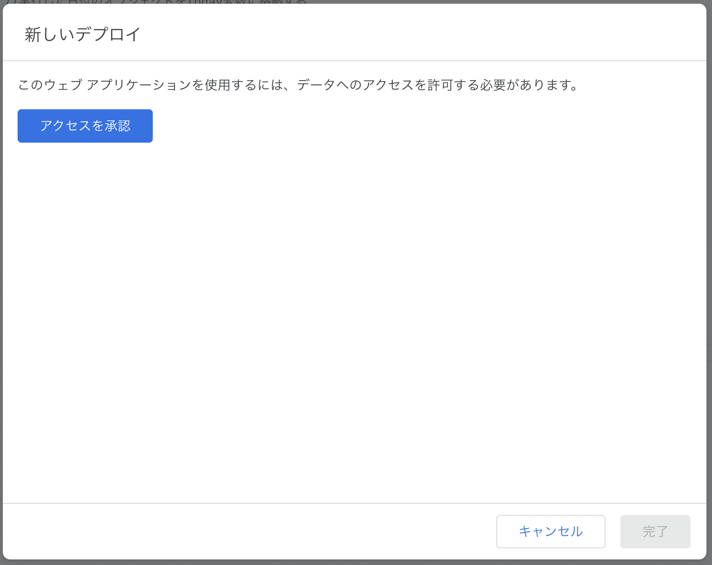
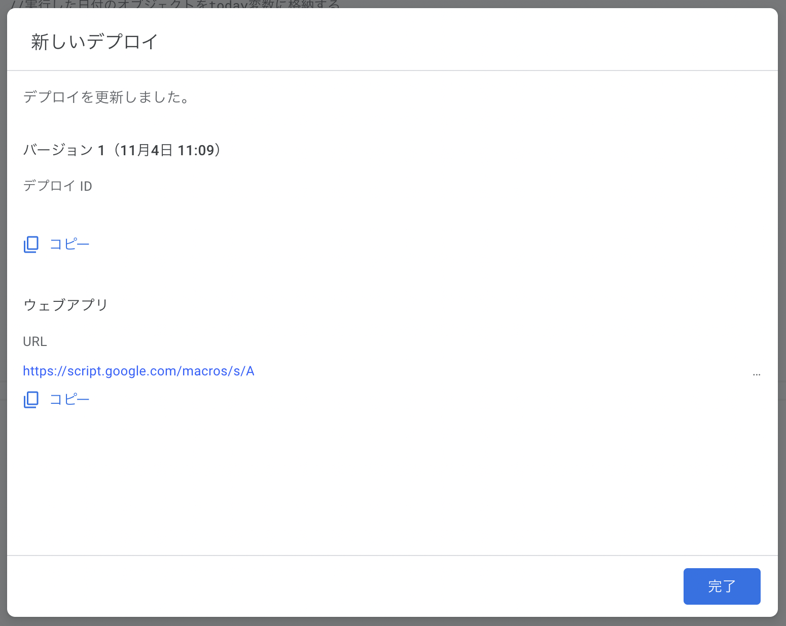

# backgroundFetchSample
Background Fetchをお試しで作成したサンプルプロジェクト

バックグラウンド状態をGoogleスプレットシートに投稿します


## Googleスプレットシート

GoogleスプレットシートにGoogleActionScript(GAS)を記述しPostできるようにします。


### 手順1 Googleスプレットシートにスクリプトを記述する

1. 新規作成したスプレットシートに、拡張機能＞Apps Scriptを開きスクリプトエディタを開きます。

   

2. 下記のコードを記述します。

```GAS
function doPost(e) {
  //実行した日付のオブジェクトをtoday変数に格納する
  let today = new Date();
  //formatDateメソッドで日付の表示形式を変換する
  today = Utilities.formatDate(today,"JST", "yyyy/MM/dd HH:mm:ss");
  
  var jsonString = e.postData.getDataAsString();
  var data = JSON.parse(jsonString);
  
  var kind = data.kind;
  var gps = data.gps;
  var steps = data.steps;
  var call = data.call;
  var charge = data.charge;
  var music = data.music;
  var systemUpTime = data.systemUpTime;

  // シート取得 - シート名は"fetch"とします
  var ss = SpreadsheetApp.openById(SpreadsheetApp.getActiveSpreadsheet().getId());
  var sheet = ss.getSheetByName("fetch");
  
  // データ入力
  sheet.appendRow([today,kind,gps,steps,call,charge,music,systemUpTime]);
}
```

3. デプロイを使って公開します。

   種類の選択で**ウェブアプリ**を選択し、下記のようにします。

   次のユーザー：自分

   アクセスできるユーザー：全員

   

4. デプロイするとアクセスを承認します。

   

5. デプロイは終わるとURLが発行されます。

   そのURLを`DataShare.swift`のlet url = "[URL]"に書き換えてください。

   


動作確認にはcurlコマンドを使って確認できます。

curlコマンド例

```
curl -v -H "Accept: application/json" -H "Content-type: application/json" -X POST -d '{"kind":"GPS","body":"35.4231362 , 139.5987453"}' [URL]
```

## 参考サイト
- [iOSアプリからスプレッドシートにデータを書き込む](https://qiita.com/kensuzuk/items/efbfaed719932822f207)
